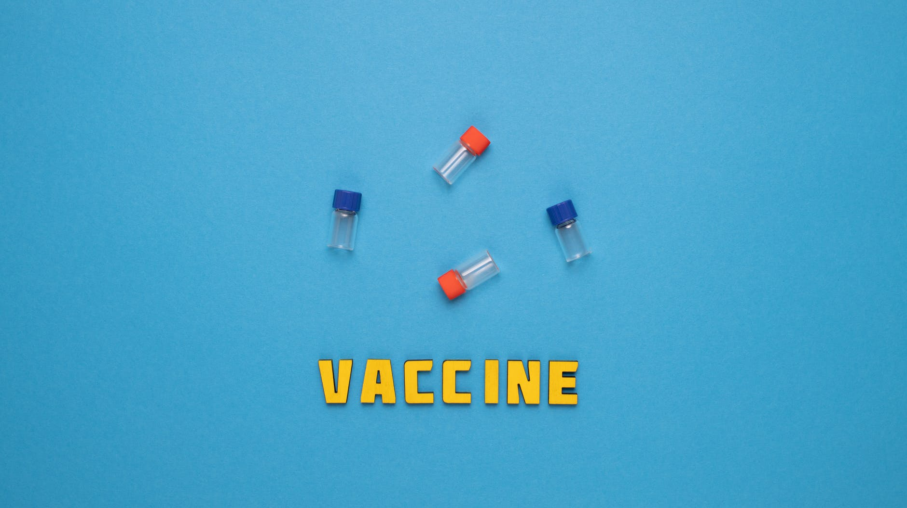

# Projeto_Amor_de_Mae (IN CONSTRUCTION)
Esse projeto contém as análises de dados do SUS e IBGE a respeito da vacinação em gestantes e óbitos fetais no Brasil e no Nordeste 

                                                                            [INCOMPLETE]

# Contents
* Introduction
* Data
* Methodology
* Tooling
* Concluisions
* Acknowledgments
* References

# Introduction

This project is the result of module 2, of the Bootcamp in Data Science applied (second edition) proposed by Alura and apoint to some analisys about the numbers of vaccines in pregnant women and fetal deaths from 1994 to 2019 in Brazil and the northeastern states of the country. These [data](#dt) are available in two official website of brazilian gorvenment: 
* Data about vaccine, were found in the official website of brazilian Bealthcare System: [DATASUS](https://www.gov.br/saude/pt-br/assuntos/saude-de-a-a-z-1/s/sistema-unico-de-saude-sus-estrutura-principios-e-como-funciona) 
* Data about fetal death, were found in the official website of Brazilian Institute of Geography and Statistics: [IBGE](https://sidra.ibge.gov.br/tabela/2992) 

Based on this I'll analyse the vaccine curve in  Brazil and in the states(with a focus on the northeastern states), seeking to answers and trying to understand the dynamics of the relationship between vaccines and  fetal deaths in Braazil.

  

## Vaccines x Fetal Death
  The Vacination of pregnant women its priority to World Health Organization (WHO), and represents the first love act betwen a mother and your baby. The vaccines prevant some complicantion in the birth moment and the diseases development during the child's growth. The maternal antibodies are very important to the baby health in the first 12 months of the pregnancy, when it still in the mother womb. The antibodies provided by the mother, protect the baby, until it can be vaccinated and develops his own immune defenses. 
  
 According to the Brazil Ministry Health , the vaccination of women pregnant reduces the numbers of fetal deaths, wich can be definide as the baby's deaths due to complications during the childbirth or the pragnancy. Besides to influence in the bith rate, the fetal death can be an indicator that help a visualization of spatial distribution, and the quality of woman health assistance. So the vaccination is responsable for avoiding problemns like:     
 
* Congenital malformations and pregnancy damage (abortion, premature birth...);

* Pregnant women and babies, constitue a high risk group for the influenza virus, and vacination can avoid the hospitalization and severe respiratory conditions caused by the virus;

* Whitout Knowing it, woman can transmit the Hepatitis B virus, to your baby;

## Vaccines analyzed

  In this project there was four vaccines it was analyzed:
  * **Hepatitis-B:**
    * The vaccination protects against the contamination for hepatitis virus, and avoid problemns such as liver inflamation, that can cronify and cause cancer and cirrhosis.
  * **DT:**
    * The Vaccination protect against the diphtheria and tetanus.  
  * **DTPA:**
    * The Vaccination protect against the diphtheria, tetanus and whooping cough.
  * **Yellow Fever:**
    * The Yellow Fever vaccination in pregnant women its a particular case, since the immunizing against the yellow fever, its made by the live virus. But acoording to the Center of Imunization for the Hospital and Maternity Santa Joana (São Paulo), and the website Vacinas para Gravidas (Vaccines for Pregnant woman, in literal traduction) such as the old people, pregnant woman hardly can develop the complication by the vaccines, and this particular vaccine it's used in special localities, when was developed many cases of yellow fever.
 

# Data

The data used in this analysis was obtained from the DATASUS aplication [TABNET](), and the IBGE aplication SIDRA on Jun 06, 2021, and you can find them, [here](https://github.com/Glaudemias/PROJETO_FINAL_MOD1-DS_2-Bootcamp_Alura/tree/main/Dados) on my repositorie. The datasets chosen have an incompatibility of the dates, and for that I decided divide them in 2 groups of the vaccines curves, wich is:

* **Group 1**
  * The vacines curves from 1994 to March 2021:
    * Hepatitis-B and Yellow Fever  
* **Group 2**
  * The vacines curves from 2013 to March 2021:
    * DTPA and DT  
And this information is used to:
  * To compare the progression of each vacine curve in Brasil;
  * To demonstrate the mosts affecteds states, with a focus on the Northeastern states.
The Five dataset analysed here, was the numbers cases of fetal deaths ranges from 2003 to 2019, in Brasil 
* Number of Deaths for Dengue Cases ranges from January 2008 to March 2021:
And this information is used to:
  * To make the comparative studies above;
  * And was used to make a statiscal aproximation, of the percentage of vaccines numbers/fetal deaths, by the year.
  
A detailed description of each vaccine curve dataset and its meaning is also provided in the DATASUS website, you can find [here](http://tabnet.datasus.gov.br/cgi/pni/Imun_doses_aplic_desde_1994.pdf)
  
# Methodology
* The datasets are analysed following the logic of approximation of the scale, when the first moment I looking for the distribution of the vaccine curve and fetal deaths per year, in the country. 
  
* The Second part I'll analyse the same datasets across the brazilian states, trying to find some correlation, and understanding the distribution of vaccine and fetal deaths in the northeastern states. 
  
* Finally I'will analysed the distibution the same datasets but, in this last part the data will spatialized in a map, considering the most critical year's and all brazilian states.

With this we were able to made some conclusions about the variables observerd, you cand find them in the [Conclusion](#concl)

# Tooling (Libraries and Technology)
This project are made in the python 3.8.5, used the Collab the cloud storage services of google, Google Collaboratory.The libraries used here, were:

* Pandas, the main librarie of data analysis in Python, used to manipulate and help in statiscal conclusion about the datasets;
* Numpy, using to heandle missing data;
* date, to transform columns in date type;
* Seabornd,Matplotlib.pyplot, for plotting of the charts;
* Geopandas, for plotting the map.

# Conclusion

# Acknowledgments
This project as said before, was proposed as a second project in the Alura's Bootcamp, as an introduction to the Data Science world. So I'm gonna say thank you one more time, to Guilherme and Thiago, for the knowledge passed on to the students, to scuba team and all the comunity it was created on the discord, you guys help so many time. THANKYOU :)

# References
**1. Papers:**

1.1. 
[Paper1](https://repositorio.ufmg.br/bitstream/1843/BUBD-9CZEKT/1/vacina__o_da_gestante_no_pr__natal___revis_o_integrativa_da_literatura.pdf) - VACINAÇÃO DA GESTANTE NO PRÉ-NATAL – Revisão integrativa da literatura 

1.2. 
[Paper2](https://www.scielo.br/j/reeusp/a/hDCqhBR6xHvxCSRVVWRffky/abstract/?lang=pt) - Atenção Pré-Natal no Município de Quixadá-CE segundo indicadores de processo do SISPRENATAL

1.3. 
[Paper3](https://scielosp.org/article/csp/1998.v14suppl1/S25-S32/) - Paism: um marco na abordagem da saúde reprodutiva no Brasil

1.4.
[Paper4](https://www.scielo.br/j/rbsmi/a/FL8MhyxcgLc7gVRv4BXzPjf/abstract/?lang=pt) - Avaliação da cobertura e indicadores do Programa de Humanização do Pré-natal e Nascimento no município de Salvador, Bahia, Brasil

**2. Articels and specialized health sites**

2.1.  [Artcle1](https://sbim.org.br/images/calendarios/calend-sbim-gestante.pdf) - CALENDÁRIO DE VACINAÇÃO SBIm GESTANTE

2.2. [Article2](http://bvsms.saude.gov.br/bvs/publicacoes/manual_obito_infantil_fetal_2ed.pdf) - Manual de Vigilância do Óbito Infantil e Fetal e do Comitê de Prevenção do Óbito Infantil e Fetal

2.3. [Article3](https://www.bio.fiocruz.br/en/images/stories/pdfs/bulas/fa/BM_BUL_045_00_V_190702_FA10Nacional.pdf) - vacina febre amarela(atenuada)5 e 10 doses
  
2.4. [Article4](https://saude.abril.com.br/familia/vacina-da-febre-amarela-em-gestantes-quando-tomar/) - Vacina da febre amarela em gestantes: quando tomar 

2.5. [Article5](https://vacinasparagravidas.com.br/) - Vacinas para Gravidas 
  
# Contact
If you have any tips or suggestions, feel free to contact me here:

And before I forget...
  

  
     ...viva o SUS :)

